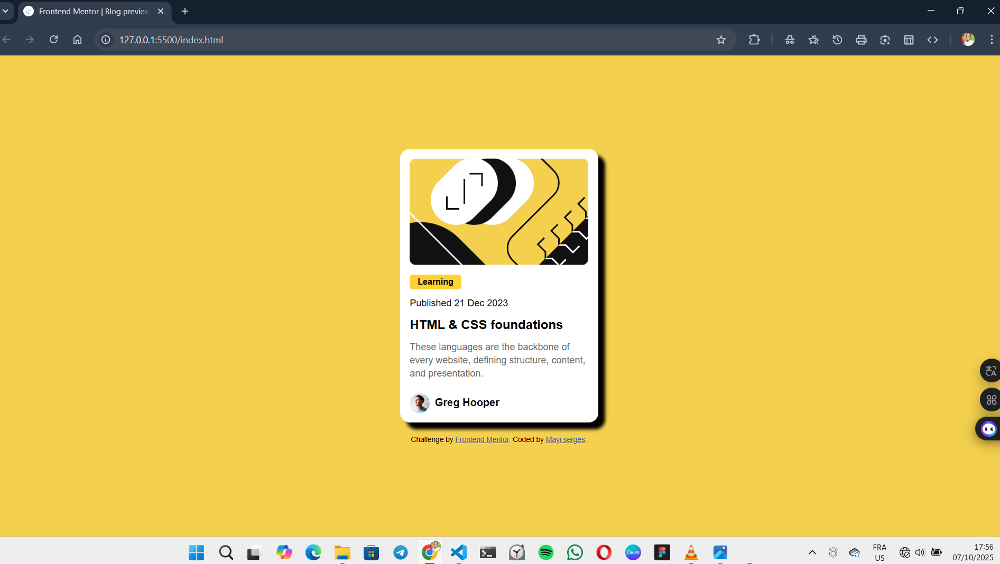

# Frontend Mentor - Blog preview card solution

This is a solution to the [Blog preview card challenge on Frontend Mentor](https://www.frontendmentor.io/challenges/blog-preview-card-ckPaj01IcS). Frontend Mentor challenges help you improve your coding skills by building realistic projects. 

## Table of contents

  - [The challenge](#the-challenge)
  - [Screenshot](#screenshot)
<!--  - [Links](#links)-->
- [My process](#my-process)
  - [Built with](#built-with)
  - [What I learned](#what-i-learned)
  - [Continued development](#continued-development)
  - [Useful resources](#useful-resources)
- [Author](#author)
- [Acknowledgments](#acknowledgments)


### The challenge

Users should be able to:

- See hover and focus states for all interactive elements on the page

### Screenshot




<!--### Links.

- Solution URL: [Add solution URL here](https://your-solution-url.com)
- Live Site URL: [Add live site URL here](https://your-live-site-url.com)
-->
## My process

First, I remembered the previous project where I had centered an element in exactly the same way I needed to for this one. In that earlier project, I had decided to combine Grid to center my card and Flexbox for the elements inside the card. So I decided to use Grid again for my main element. Unfortunately, it didn’t work as I wanted. I did some research, after which I decided to rebuild the project entirely with Flexbox. It was much easier that way.
I also struggled a bit with organizing my HTML tags.

### Built with

- Semantic HTML5 markup
- CSS custom properties
- Flexbox
- Mobile-first workflow

### What I learned

The `<span>` tag is used on text when you don’t want the element to take up the full width.
```html
<span class="tag">Learning</span>
```

J'ai pu mettre l'image et le texte sur la meme ligne grace  a la balise <span> si j'avais utlise <p> le texte serait en dessous de l'image
```html
<div class="author">
    
    <span>Greg Hooper</span>
</div>
```
```css
.proud-of-this-css {
  color: papayawhip;
}
```


If you want more help with writing markdown, we'd recommend checking out [The Markdown Guide](https://www.markdownguide.org/) to learn more.


### Continued development

Je ne maitrise pas encore les circonstances pour utiliser le Grid ou la Flexbox mais ce n'est pas un probleme car ce n'est que mon deuxieme projet depuis que j'ai appris le html et le CSS. Je veux mieux apprendre a m'en servir. Presentement je compte encre des fois sur l'IA. Je ne sais pas si c'est mal mais je suppose que pour un debut c'est normal. Mon objectif est d'etre de moins en moins dependant de l'IA.


### Useful resources

- [Example resource 1](https://www.example.com) - This helped me for XYZ reason. I really liked this pattern and will use it going forward.
- [Example resource 2](https://www.example.com) - This is an amazing article which helped me finally understand XYZ. I'd recommend it to anyone still learning this concept.


## Author

<!-- - Website - [Add your name here](https://www.your-site.com) -->
- Frontend Mentor - [@Hightechvisual](https://www.frontendmentor.io/profile/Hightechvisual)
- Twitter - [@mayiwilliam](https://x.com/mayiwilliam?t=Gg_xHm-Ms27YJzwSY646Pg&s=09)

## Acknowledgments

Je l'ai fait seule sans l'aide d'aucune personne exterieur donc je m'attribue tout le credit.
